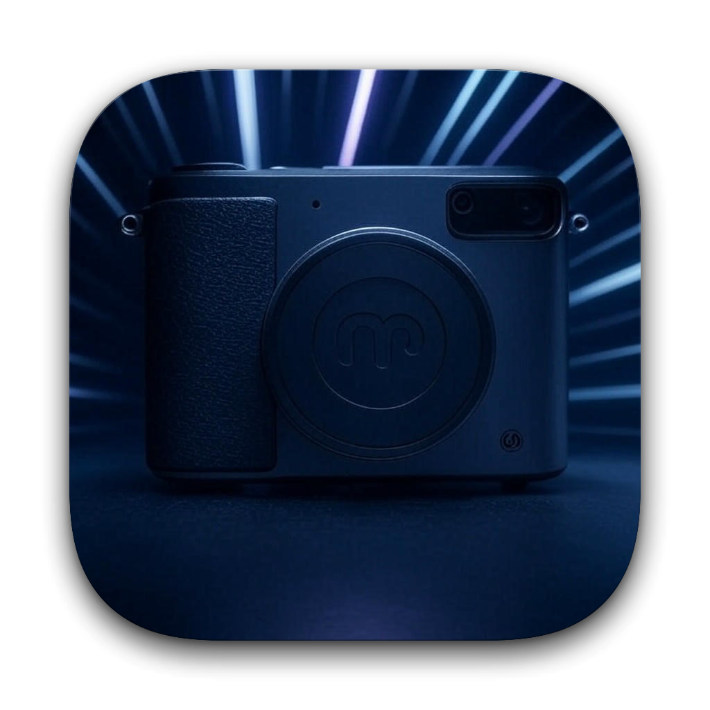

# Photon

<p align="center">
  
</p>

<p align="center">
  <strong>Lightning-fast, native macOS photo framing and border studio.</strong>
  <br />
  Designed for photographers, content creators, and printmakers.
</p>

<p align="center">
  
  
  
  
  
</p>

---

## Screenshots


---

## Highlights

- ⚡ **Instant Startup**: Launches in under 30 milliseconds with zero runtime overhead or heavy interpreter delays.
- 🎨 **True macOS Native Design**: Seamless integration with macOS Sequoia, featuring translucent materials (`.ultraThinMaterial`), standard system controls, SF Symbols, native color pickers, and automatic dark/light appearance.
- 📐 **Smart Aspect Ratio Framing**: Automatically fits photos into standard social media and print aspect ratios:
  - **4:5**: Optimized for Instagram portrait feed posts
  - **1:1**: Clean square presentation
  - **9:16**: Fullscreen Stories and Reels
  - **Polaroid**: Authentic physical proportions (4.5mm top/side borders, 23.5mm bottom chin based on classic 88mm × 107mm frames)
  - **3:4**, **4:3**, and **16:9** widescreen ratios
- 🔗 **Granular Border Linking**: Control individual borders or link pairs together:
  - **Link Top & Bottom** (Vertical symmetry)
  - **Link Left & Right** (Horizontal symmetry)
  - **Master "Link All"** for uniform 4-sided borders
  - Precise sliders (0–500 px) with numeric entry supporting up to 10,000 px
- 🎞️ **Multi-Image Filmstrip**:
  - Unified session supporting single photos or batches
  - Interactive bottom filmstrip carousel with thumbnail badges and hover removal
  - Docked **"Add Image"** card at the end of the filmstrip
  - Floating **"Add Image"** capsule button when editing a single photo
  - Full drag-and-drop support from Finder for images and entire folders
- 📊 **Real-Time Canvas HUD**: Floating monospaced info badge dynamically shows source resolution, final output dimensions, target ratio, and exact directional padding.
- 🚀 **Parallel Apple Silicon Export**: Multi-threaded export engine powered by Swift Concurrency (`TaskGroup`) and CoreGraphics, rendering full-resolution exports across all CPU performance cores simultaneously.
- 💾 **Preset Management**: Save and load custom border configurations to JSON files for rapid, repeatable workflows.

---

## Getting Started

### Requirements
- **macOS 15.0 (Sequoia)** or later
- **Apple Silicon** (`arm64` — M1, M2, M3, M4 series)
- Xcode 16+ or Command Line Tools (for building from source)

### Run Pre-Built App
If you've built the app locally or downloaded a release:
```bash
open build/Photon.app
```

### Build from Source

Build the standalone macOS `.app` bundle with a single command:
```bash
./build.sh
```
The compiled bundle will be generated at `build/Photon.app`.

### Open in Xcode
Open the Swift Package directly in Xcode for development or debugging:
```bash
open Package.swift
```

---

## Keyboard Shortcuts

| Shortcut | Action |
| :--- | :--- |
| <kbd>⌘</kbd> <kbd>O</kbd> | Pick image(s) from disk |
| <kbd>⌘</kbd> <kbd>V</kbd> | Paste image from clipboard |
| <kbd>⌘</kbd> <kbd>S</kbd> | Export active image or batch |
| <kbd>⌫</kbd> / <kbd>Delete</kbd> | Remove active image from session |
| <kbd>→</kbd> | Select next image in filmstrip |
| <kbd>←</kbd> | Select previous image in filmstrip |
| <kbd>⌘</kbd> <kbd>⇧</kbd> <kbd>S</kbd> | Save current border settings preset (JSON) |
| <kbd>⌘</kbd> <kbd>⇧</kbd> <kbd>O</kbd> | Load border settings preset (JSON) |

---

## Project Structure

```
photon/
├── Package.swift               # Swift 6 Package Manifest
├── Info.plist                  # macOS Application Bundle Metadata
├── build.sh                    # Build entry point (invokes Scripts/build_app.sh)
├── Scripts/
│   └── build_app.sh            # Standalone compiler and bundle packager
├── Resources/
│   ├── icon.icns               # macOS App Icon
│   └── icon.png                # High-res icon asset
├── Sources/
│   └── PhotonApp/
│       ├── PhotonApp.swift     # App entry point & lifecycle delegate
│       ├── Models/             # Aspect ratios, border modes, settings & items
│       ├── Services/           # CoreGraphics renderer, auto calculator, batch exporter
│       ├── ViewModels/         # Main studio observable view model
│       └── Views/
│           ├── Canvas/         # Canvas preview & CanvasInfoBadge HUD
│           ├── Filmstrip/      # Bottom carousel & thumbnail item views
│           ├── Sidebar/        # Controls, palette, sliders & export action
│           ├── Export/         # Batch export progress sheet
│           └── MainView.swift  # Root view layout & shortcut handler
└── .github/
    └── workflows/
        └── build.yml           # CI/CD: Automated builds on macOS-15 runners
```

---

## License

Distributed under the MIT License. See `LICENSE` for details.
